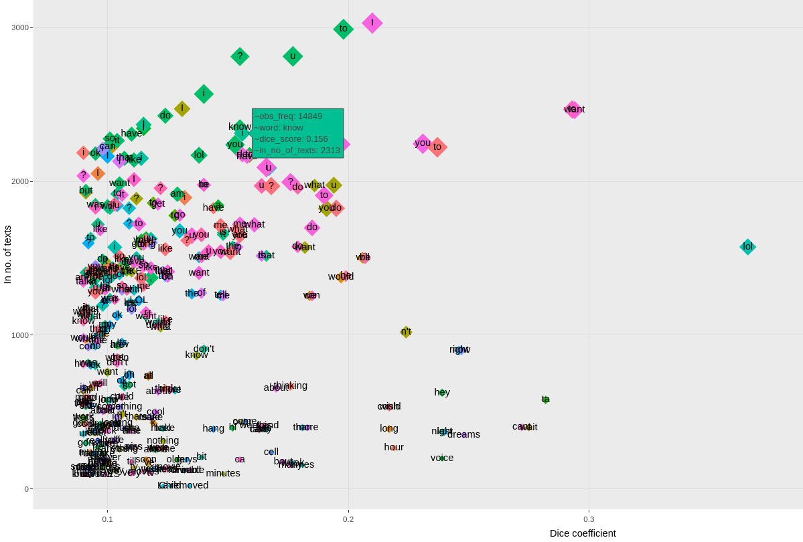

# The communicative modus operandi of online child sexual groomers

> The case study [utilised] in this section is based on the research conducted at Swansea University Department of Applied Linguistics under the supervision of Prof. Nuria Lorenzo-Dus as part of the project ‘Online Grooming Discourse’ funded by EPSRC–CHERISH-DE and NSPCC (Lead Investigator: Prof. Nuria Lorenzo-Dus). In 2021 the project evolved into Project Dragon-S[^sn2] (Developing Resistance Against Grooming Online – Spot and Shield). Outputs from the research are published in {cite:p}`lorenzo-dusYourMomCute2019` and {cite:p}`lorenzo-dusCommunicativeModusOperandi2020`, which served as basis for the contents [described].[^sn1]

## Collecting the data from [Perverted Justice](http://perverted-justice.com/)[^sn4]

```{rli} https://github.com/catlism/catlism_scripts/raw/main/s6.05_chatlog-scraper_with-comments.py
:name: s6-05
:caption: Script `[s6.05]` [{octicon}`download;1em;sd-text-primary`](https://github.com/catlism/catlism_scripts/raw/main/s6.05_chatlog-scraper_with-comments.py) (adapted from {cite:p}`morganJaypmorganChatlogscrapperArchivedoi2022`)
:linenos:
:lines: 20-
```

## Creating the final corpus[^sn5]

> Script `[s6.06]` applies the steps described in sections ‘Emoticons’, ‘Duration and Turns’, and ‘Metadata’ to the collected CSV files and outputs an XML fle for each of them using the structure exemplified in `[e6.08]`[^sn6]

```{rli} https://github.com/catlism/catlism_scripts/raw/main/s6.06_chatlog_create_XML.py
:name: s6-06
:caption: Script `[s6.06]` [{octicon}`download;1em;sd-text-primary`](https://github.com/catlism/catlism_scripts/raw/main/s6.06_chatlog_create_XML.py)
:linenos:
:lines: 20-
```

## Sample from the final corpus[^sn3]
```{code-block} xml
:name: e6-08
:caption: Example `[e6.08]`
:linenos:
<?xml version='1.0' encoding='UTF-8'?>
<corpus>
    <text id="dz1cVUMyIB99080150" timing="1333" user="luv2licku68">
        <u turn="1" username="luv2licku68" time="8:54:50 PM" date="04112010" usertype="g"> hey there, how are you doing?</u>
        <u turn="2" username="katierella1013" time="8:54:01 PM" date="04112010" usertype="d"> hi a/s/l?  §_HAPPY-SMILEY_§ </u>
        ...
        <u turn="19" username="katierella1013" time="8:59:13 PM" date="04112010" usertype="d">
            well i
            <normalised orig="dunno" auto="true">don't know</normalised>
            , like the stuff some people say and there's like so much going on, so many conversations
            <normalised orig="n" auto="true">and</normalised>
            stuff
        </u>
    </text>
    ...
</corpus>
```

## Example of the interactive plot created for the visual exploration of collocations[^sn7]

:::{figure-md} fig6-3
:class: figure



*Figure 6.3* Example of the interactive plot created for the visual exploration of collocations
:::

```{button-link} https://mdic.github.io/og_plot/
:color: primary
:expand:
Consult the original interactive plot
```

[^sn1]: `CATLISM, 350`
[^sn2]: www.swansea.ac.uk/project-dragon-s/
[^sn3]: `CATLISM, 352-353`
[^sn4]: `CATLISM, 353-357`
[^sn5]: `CATLISM, 360-366`
[^sn6]: `CATLISM, 360`
[^sn7]: `CATLISM, 368`