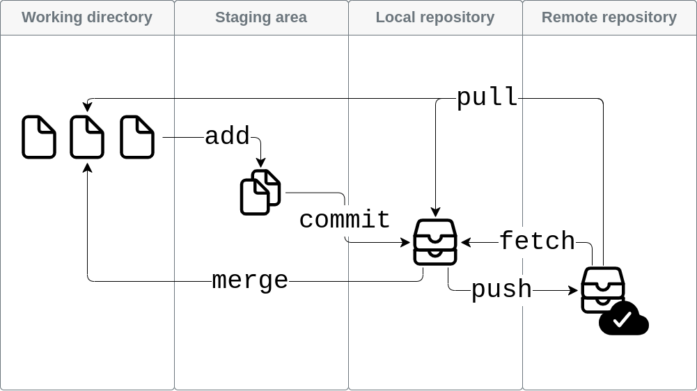

# Git 101: the basics[^sn1]

As one of the "most widely adopted distributed open source solution for keeping track of changes to files [...] `git` works by creating an environment that retains details of each change made to the fles being tracked, allowing one or more users to have a complete log of the edits made to the data throughout time by the
users acting upon it."[^sn2]. Installation files and instructions can be found on `git` [official website](https://git-scm.com/downloads) and [official documentation](https://git-scm.com/book/en/v2) {cite:p}`chacon_pro_2022` respectively.  
Figure 4.4 graphically summarises the basic operations, exemplified through the actual commands further below.


:::{figure-md} fig4-4
:class: figure



*Figure 4.4* Graphical rendition of git basic workfow
:::

## Initiate `git` in a local folder

```{code-block} bash
:name: c4-06
:caption: Command `[c4.06]`

git init
```

:::{dropdown} {octicon}`video;2em` `[c4.06]`
```{eval-rst}
.. asciinema:: 606984
```
:::


## Clone a remote repository
```{code-block} bash
:name: c4-07
:caption: Command `[c4.07]`

git clone https://github.com/catlism/catlism.github.io.git
```

:::{dropdown} {octicon}`video;2em` `[c4.07]`
```{eval-rst}
.. asciinema:: 606985
```
:::


## Add all changes (even from previously untracked files) to the local `git` database (i.e. `stage` the changes)
```{code-block} bash
:name: c4-08
:caption: Command `[c4.08]`

git add -A
```

## Record (`commit`) all changes, along with a textual description of what has been changed
```{code-block} bash
:name: c4-09
:caption: Command `[c4.09]`

git commit -m "Description of the changes"
```

## Send (`push`) all changes to the remote repository
```{code-block} bash
:name: c4-10
:caption: Command `[c4.10]`

git push
```

## Obtain (`fetch`) all changes from the remote repository
```{code-block} bash
:name: c4-11
:caption: Command `[c4.11]`

git fetch
```

## Include/apply (`fetch`) all changes from the remote repository to the local repository
```{code-block} bash
:name: c4-12
:caption: Command `[c4.12]`

git merge
```

## Obtain *and* include/apply (`pull`) all changes from the remote repository to the local repository
```{code-block} bash
:name: c4-13
:caption: Command `[c4.13]`

git pull
```

[^sn1]: `CATLISM, 123-126`
[^sn2]: `CATLISM, 123`