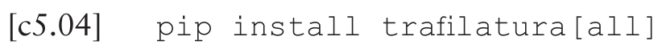

# Copy-pasting code from the PDF version of the book 

Readers reaching the website from the PDF version of the book may have noticed that copy-pasting commands and scripts from the digital edition of the book may produce errors once the commands/scripts are run on the PC. This is most likely due to the formatting of the code in the PDF file, where - for typesetting reasons - the font employed generates incorrect results when pasted to plain-text. These can be the result of a number of reasons, including:

- the presence of [ligatures](https://en.wikipedia.org/wiki/Ligature_(writing)): one such example is the word `trafilatura` as in [`[c5.04]`](../data_collection/general_purpose/trafilatura.md#c5-04) - reported below in [fig. 0.06](#fig0-06)  where the letters `f` and `i` are included as one single character (representing the ligature `fi`) instead of two separate ones (`fi`)
- the use of alternative characters: it is the case of [`[c5.31]`](../data_collection/social_media_platforms/youtube/yt-dlp_ytcd.md#c5-31) where the character `EN DASH` (Unicode character `U+2013`, see [fig. 0.07](#fig0-07) for a depiction of how it appears in the PDF version) is used instead of `HYPHEN-MINUS` (Unicode character `U+002D`). While they may appear identical, they are in fact two different entities: this can be noted when put side-by-side `-–`. In CLI commands and scripts only the `HYPHEN-MINUS` one is accepted.

:::{figure-md} fig0-06
:class: figure

*Figure 0.06* Example of ligature as included in the PDF version of the book
:::

:::{figure-md} fig0-07
:class: figure

*Figure 0.07* Example of `EN-DASH` as included in the PDF version of the book
:::
